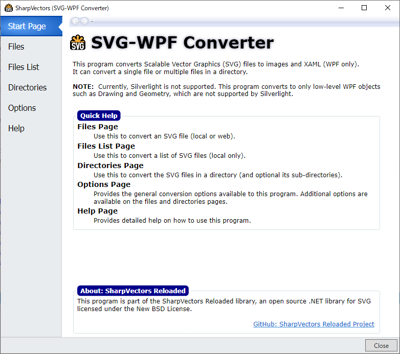

# SvgXaml
[SharpVectors](https://github.com/ElinamLLC/SharpVectors/) based application for converting SVG to XAML files.
It converts a single SVG file, multiple SVG files and directory of SVG files to XAML for WPF applications.

## Installation
The SharpVectors library targets the following frameworks
* .NET Framework, Version 4.6
* .NET Framework, Version 4.8
* .NET Core, Version 3.1
